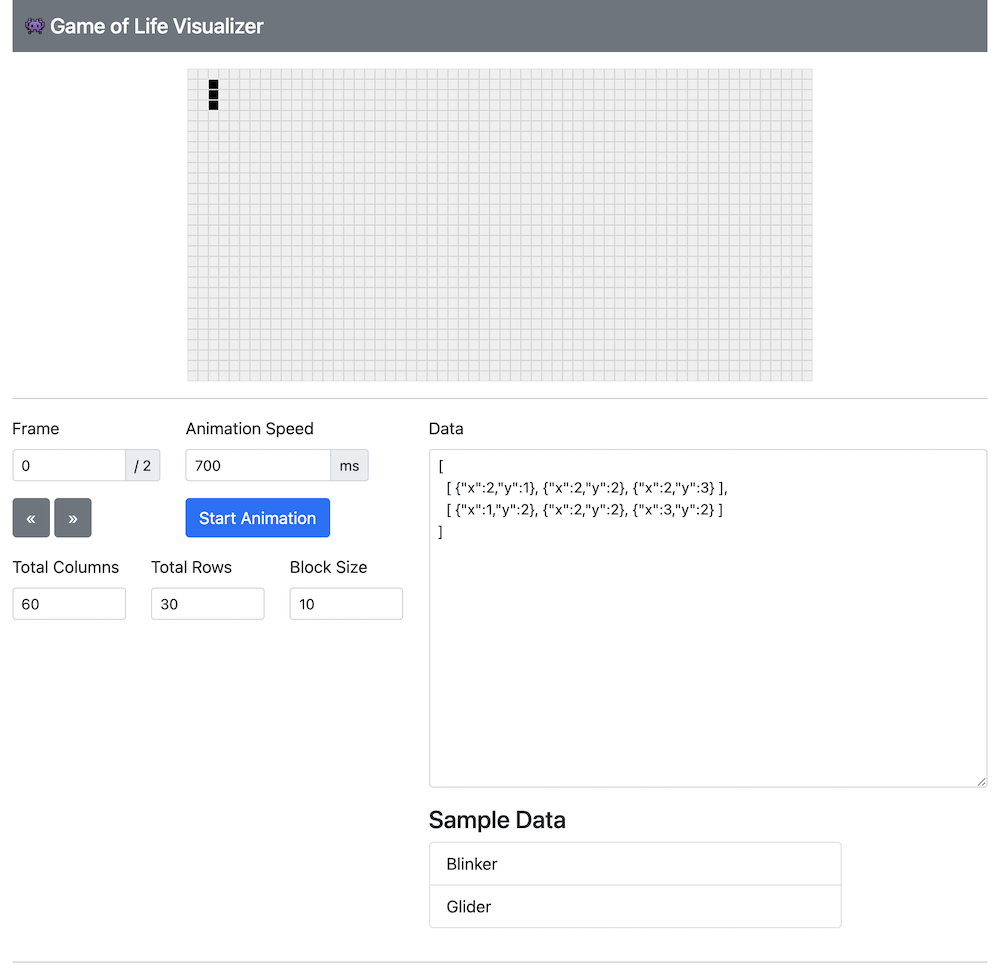

# Game of Life Visualizer

This project aims to create a visualisation layer for people attempting the [Game of Life Kata](https://en.wikipedia.org/wiki/Conway%27s_Game_of_Life). So in essence, you focus on the logic, generate an output that can be used for this project to render the animation between different generations.

Especially helpful if you want to participate in the [Global Day of CodeRetreat](https://www.coderetreat.org/)



## Input Format

Provide a 2D array in JSON format:

- 1st layer denotes the generations
- 2nd layer denotes the list of live cells (expressed with their X & Y coordinates).

Example:

```json
[
  [ {"x":2,"y":1}, {"x":2,"y":2}, {"x":2,"y":3} ],
  [ {"x":1,"y":2}, {"x":2,"y":2}, {"x":3,"y":2} ]
]
```

## License

MIT License

## Contributors

- [miccheng](https://github.com/miccheng)